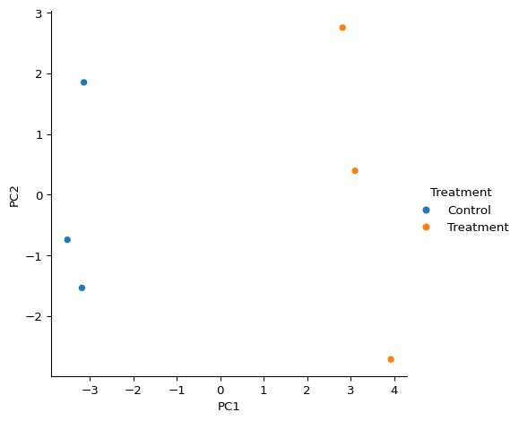

# Exploratory data analysis using pydata

## `pydata`

`pydata` is a python package developed for the analysis and
visualisation of L-shaped datasets. It can either be installed locally
using `poetry` or an docker container environment has also be created
which can be used for development and running the following examples.

`docker run -it docker.io/jsleight1/pydata:3.10-latest`

``` python
from pydata.pydata import pydata

x = pydata.example_pydata()

print(x)
print(x.data.head(2))
print(x.description.head(2))
print(x.annotation.head(2))
```

    pydata object:
     - Dimensions: 5 (samples) x 20 (features)
              Sample1  Sample2  Sample3  Sample4  Sample5
    Feature1        1        5        3        4        2
    Feature2        1        7        9        0        1
            ID
    0  Sample1
    1  Sample2
             ID
    0  Feature1
    1  Feature2

## Linear dimensionality reduction using principal component analysis (PCA).

``` python
x.compute_pca()

print(x.pcs)

print(x.pcs.data)
print(x.pcs.description.head(2))
print(x.pcs.annotation)
```

    pca object:
     - Dimensions: 5 (samples) x 5 (principal components)
     - Scaling: Zscore
     - Method: SVD
              Sample1       Sample2       Sample3       Sample4       Sample5
    PC1 -2.385297e+00  2.681569e+00  4.033243e+00 -2.037196e+00 -2.292319e+00
    PC2 -1.961247e+00  3.147872e+00 -2.578395e+00  1.843378e+00 -4.516076e-01
    PC3 -2.485807e+00 -2.133184e-01  1.770359e-01 -1.136529e+00  3.658618e+00
    PC4 -1.803378e+00 -1.810352e+00  1.282396e+00  2.841523e+00 -5.101890e-01
    PC5  5.277064e-16  5.277064e-16  5.277064e-16  5.277064e-16  5.277064e-16
            ID
    0  Sample1
    1  Sample2
        ID Percentage variance explained
    0  PC1                       38.5524
    1  PC2                     24.005699
    2  PC3                     20.933268
    3  PC4                     16.508632
    4  PC5                           0.0

## Plotting

``` python
# PCA 
x.plot(type = "pca")
```


