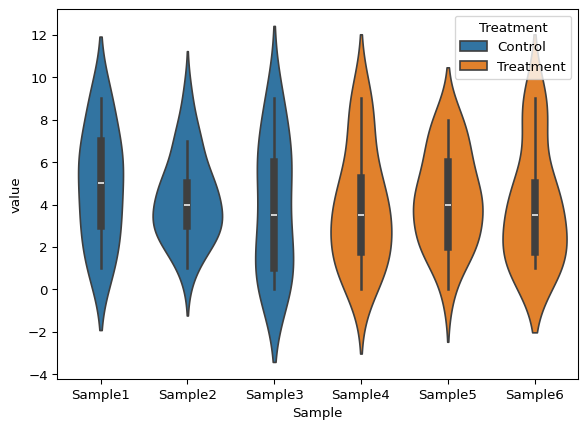
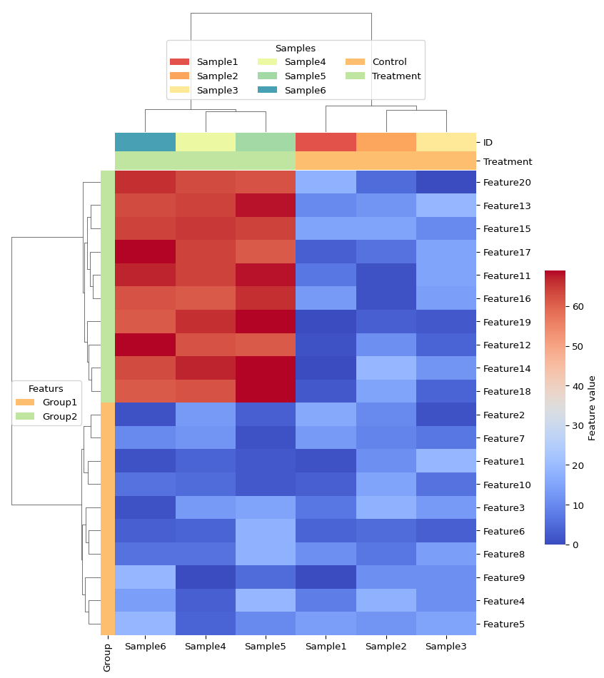
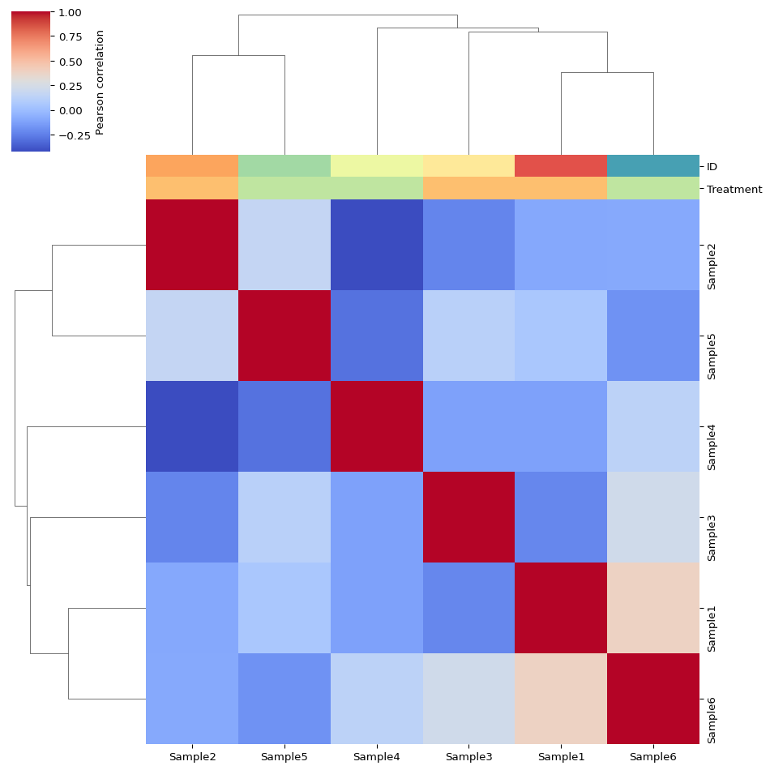
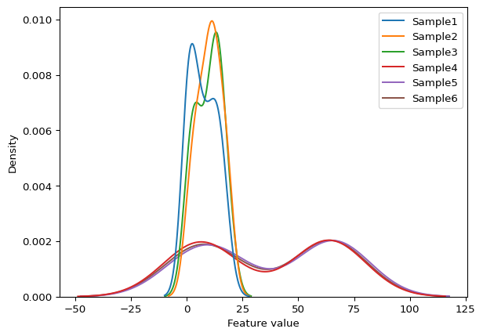

# Exploratory data analysis using pydata

## `pydata`

`pydata` is a python package developed for the analysis and
visualisation of L-shaped datasets. It can either be installed locally
using `poetry` or an docker container environment has also be created
which can be used for development and running the following examples.

`docker run -it docker.io/jsleight1/pydata:3.10-latest`

``` python
import matplotlib.pyplot as plt
from pydata.pydata import pydata

x = pydata.example_pydata()

print(x)
print(x.data.head(2))
print(x.description.head(2))
print(x.annotation.head(2))
```

    pydata object:
     - Dimensions: 6 (samples) x 20 (features)
              Sample1  Sample2  Sample3  Sample4  Sample5  Sample6
    Feature1        1       11       19        4        2        1
    Feature2       16       10        1       13        3        1
            ID Treatment
    0  Sample1   Control
    1  Sample2   Control
             ID   Group
    0  Feature1  Group1
    1  Feature2  Group1

## Linear dimensionality reduction using principal component analysis (PCA).

``` python
x.compute_pca()

print(x.pcs)

print(x.pcs.data)
print(x.pcs.description.head(2))
print(x.pcs.annotation)
```

    pca object:
     - Dimensions: 6 (samples) x 5 (principal components)
     - Scaling: Zscore
     - Method: SVD
          Sample1   Sample2   Sample3   Sample4   Sample5   Sample6
    PC1 -3.140591 -3.520674 -3.185890  2.816192  3.928544  3.102418
    PC2  1.850772 -0.743074 -1.536801  2.752167 -2.715325  0.392261
    PC3 -0.828635  0.184406  0.456646 -1.375358 -1.784198  3.347140
    PC4 -1.955908  2.090800 -0.386352  1.168430 -0.554704 -0.362266
    PC5 -0.784204 -1.037324  1.772208  0.814677 -0.470526 -0.294831
            ID Treatment
    0  Sample1   Control
    1  Sample2   Control
        ID Percentage variance explained
    0  PC1                     54.498126
    1  PC2                     17.867131
    2  PC3                     14.339572
    3  PC4                      8.458709
    4  PC5                      4.836462

## Plotting

``` python
x.plot(type = "pca", colour_by = "Treatment")
plt.show()

x.plot(type = "violin", colour_by = "Treatment")
plt.show()

x.plot(
    type = "feature_heatmap", 
    annotate_samples_by = ["ID", "Treatment"], 
    annotate_features_by = ["Group"]
)
plt.show()

x.plot(
    type = "correlation_heatmap", 
    annotate_samples_by = ["ID", "Treatment"]
)
plt.show()

x.plot(type = "density")
plt.show()
```









