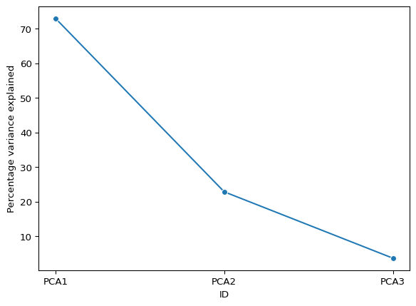
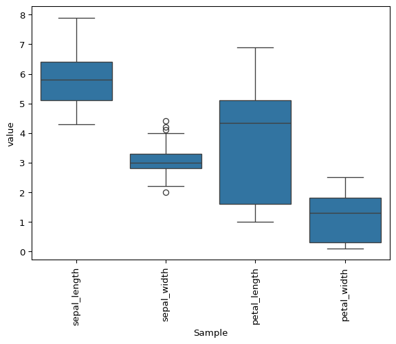

# Exploratory data analysis using pydata

## `pydata`

`pydata` is a python package developed for the analysis and
visualisation of L-shaped datasets. It can either be installed locally
using `poetry` or an docker container environment has also be created
which can be used for development and running the following examples.

`docker run -it docker.io/jsleight1/pydata:3.10-latest`

## Pydata generation and handling

``` python
import matplotlib.pyplot as plt
from pydata.pydata import pydata

x=pydata.example_pydata(type="iris")
print(x)
```

    pydata object:
     - Dimensions: 150 (samples) x 4 (features)

``` python
print(x.data)
```

                  Sample1  Sample2  Sample3  Sample4  Sample5  Sample6  Sample7  \
    sepal_length      5.1      4.9      4.7      4.6      5.0      5.4      4.6   
    sepal_width       3.5      3.0      3.2      3.1      3.6      3.9      3.4   
    petal_length      1.4      1.4      1.3      1.5      1.4      1.7      1.4   
    petal_width       0.2      0.2      0.2      0.2      0.2      0.4      0.3   

                  Sample8  Sample9  Sample10  ...  Sample141  Sample142  \
    sepal_length      5.0      4.4       4.9  ...        6.7        6.9   
    sepal_width       3.4      2.9       3.1  ...        3.1        3.1   
    petal_length      1.5      1.4       1.5  ...        5.6        5.1   
    petal_width       0.2      0.2       0.1  ...        2.4        2.3   

                  Sample143  Sample144  Sample145  Sample146  Sample147  \
    sepal_length        5.8        6.8        6.7        6.7        6.3   
    sepal_width         2.7        3.2        3.3        3.0        2.5   
    petal_length        5.1        5.9        5.7        5.2        5.0   
    petal_width         1.9        2.3        2.5        2.3        1.9   

                  Sample148  Sample149  Sample150  
    sepal_length        6.5        6.2        5.9  
    sepal_width         3.0        3.4        3.0  
    petal_length        5.2        5.4        5.1  
    petal_width         2.0        2.3        1.8  

    [4 rows x 150 columns]

``` python
print(x.description.head(2))
```

            ID Species
    0  Sample1  setosa
    1  Sample2  setosa

``` python
print(x.annotation)
```

                 ID    type
    0  sepal_length  length
    1   sepal_width   width
    2  petal_length  length
    3   petal_width   width

``` python
s=x.subset(
    samples=["Sample1", "Sample30", "Sample52"], 
    features=["sepal_length", "petal_length"]
)
print(s)
```

    pydata object:
     - Dimensions: 3 (samples) x 2 (features)

``` python
t=x.transpose()
print(t)
```

    pydata object:
     - Dimensions: 4 (samples) x 150 (features)

## Dimension reduction

### PCA

``` python
x.perform_dimension_reduction("pca")

print(x.pcs)
```

    pca object:
     - Dimensions: 150 (samples) x 2 (principal components)
     - Scaling: Zscore
     - Method: SVD

``` python
print(x.pcs.data)
```

          Sample1   Sample2   Sample3   Sample4   Sample5   Sample6   Sample7  \
    PC1 -2.264703 -2.080961 -2.364229 -2.299384 -2.389842 -2.075631 -2.444029   
    PC2  0.480027 -0.674134 -0.341908 -0.597395  0.646835  1.489178  0.047644   

          Sample8   Sample9  Sample10  ...  Sample141  Sample142  Sample143  \
    PC1 -2.232847 -2.334640 -2.184328  ...   2.014810   1.901784   1.157882   
    PC2  0.223148 -1.115328 -0.469014  ...   0.613886   0.689575  -0.698870   

         Sample144  Sample145  Sample146  Sample147  Sample148  Sample149  \
    PC1   2.040558   1.998147   1.870503   1.564580   1.521170   1.372788   
    PC2   0.867521   1.049169   0.386966  -0.896687   0.269069   1.011254   

         Sample150  
    PC1   0.960656  
    PC2  -0.024332  

    [2 rows x 150 columns]

``` python
print(x.pcs.description)
```

                ID    Species
    0      Sample1     setosa
    1      Sample2     setosa
    2      Sample3     setosa
    3      Sample4     setosa
    4      Sample5     setosa
    ..         ...        ...
    145  Sample146  virginica
    146  Sample147  virginica
    147  Sample148  virginica
    148  Sample149  virginica
    149  Sample150  virginica

    [150 rows x 2 columns]

``` python
print(x.pcs.annotation)
```

        ID  Percentage variance explained
    0  PC1                      72.962445
    1  PC2                      22.850762

### LDA

``` python
x.perform_dimension_reduction("lda", target="Species")
```

``` python
print(x.lda)
```

    lda object:
     - Dimensions: 150 (samples) x 2 (LDA components)
     - Target: Species

``` python
print(x.lda.data)
```

          Sample1   Sample2   Sample3   Sample4   Sample5   Sample6   Sample7  \
    LD1  8.061800  7.128688  7.489828  6.813201  8.132309  7.701947  7.212618   
    LD2 -0.300421  0.786660  0.265384  0.670631 -0.514463 -1.461721 -0.355836   

          Sample8   Sample9  Sample10  ...  Sample141  Sample142  Sample143  \
    LD1  7.605294  6.560552  7.343060  ...  -6.653087  -5.105559  -5.507480   
    LD2  0.011634  1.015164  0.947319  ...  -1.805320  -1.992182   0.035814   

         Sample144  Sample145  Sample146  Sample147  Sample148  Sample149  \
    LD1  -6.796019  -6.847359  -5.645003  -5.179565  -4.967741  -5.886145   
    LD2  -1.460687  -2.428951  -1.677717   0.363475  -0.821141  -2.345091   

         Sample150  
    LD1  -4.683154  
    LD2  -0.332034  

    [2 rows x 150 columns]

### t-SNE

``` python
x.perform_dimension_reduction("tsne")
```

``` python
print(x.tsne)
```

    tsne object:
     - Dimensions: 150 (samples) x 2 (features)

``` python
print(x.tsne.data)
```

             Sample1    Sample2    Sample3    Sample4    Sample5    Sample6  \
    TSNE1 -23.580931 -26.291704 -26.193335 -26.638256 -23.545013 -21.608295   
    TSNE2  -0.522060  -1.093696   0.053057  -0.321696  -0.941377  -0.810961   

             Sample7    Sample8    Sample9   Sample10  ...  Sample141  Sample142  \
    TSNE1 -25.960800 -24.347078 -27.391277 -25.768770  ...   12.46354  11.074054   
    TSNE2   0.458465  -0.496077  -0.301682  -0.945293  ...   -4.81950  -4.504594   

           Sample143  Sample144  Sample145  Sample146  Sample147  Sample148  \
    TSNE1  11.334437  12.740586  13.016592  11.363099  10.691204  11.097084   
    TSNE2   0.373205  -5.528937  -5.062658  -4.289077  -1.015444  -3.357184   

           Sample149  Sample150  
    TSNE1  13.195991  10.712410  
    TSNE2  -3.724547   0.427633  

    [2 rows x 150 columns]

## Plotting

``` python
x.plot(type="pca", colour_by="Species")
```


``` python
x.plot(type="lda")
```


``` python
x.plot(type="tsne", colour_by="Species")
```


``` python
x.transpose().plot(type="violin", fill=False)
```


``` python
x.plot(
    type="feature_heatmap", 
    annotate_samples_by=["Species"], 
    annotate_features_by=["type"], 
    xticklabels=False
)
```



``` python
x.plot(
    type="correlation_heatmap", 
    annotate_samples_by=["Species"], 
    xticklabels=False,
    yticklabels=False
)
```

    /usr/local/lib/python3.10/site-packages/seaborn/matrix.py:560: UserWarning: Clustering large matrix with scipy. Installing `fastcluster` may give better performance.
      warnings.warn(msg)
    /usr/local/lib/python3.10/site-packages/seaborn/matrix.py:560: UserWarning: Clustering large matrix with scipy. Installing `fastcluster` may give better performance.
      warnings.warn(msg)


``` python
x.plot(type="distribution", kind="kde", legend=False)
```


``` python
x.transpose().subset(["sepal_length"]).plot(type="distribution", kde=True)
```


``` python
x.transpose().plot(type="distribution", kind="ecdf")
```


``` python
x.transpose().plot(type="scatter", xaxis="petal_length", yaxis="sepal_length")
```


